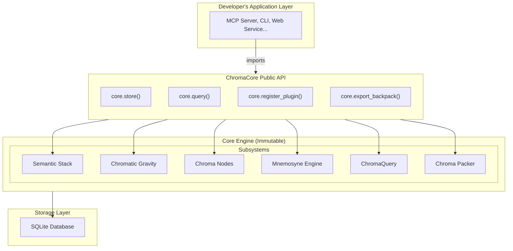

# ChromaCore Architecture Overview

**Version:** 1.0.0  
**Status:** Final Specification  
**Last Updated:** 2025-12-21

---

## Related Specifications

- [SDK API](./Chroma_Core_SDK_API.md)
- [Chromatic Gravity](./Chromatic_Gravity_Spec.md)
- [Mnemosyne Engine](./Mnemosyne_Engine_Spec.md)

---

## Design Philosophy

ChromaCore is a **library**, not an application. It provides semantic memory storage as a building block for larger systems.

**Key Principles:**

1. **Import, don't deploy:** Developers `pip install chromacore` and integrate it directly into their runtime.
2. **Extend via plugins, never fork:** Core logic is immutable; domain-specific extensions live in the plugin layer.
3. **Immutable core, flexible edges:** The physics of memory (gravity, decay) are fixed to ensure backpack portability.
4. **Single excellent implementation (Python):** Focus on v1.0 being robust and production-ready in Python.

## Component Architecture

## Data Flow: Store Operation

1. **Input:** Developer provides content, label, and hashtags.
2. **Auto-Scan (Optional):** SDK `suggest_hashtags()` may be used to find tags in content (User confirmation required).
3. **Validation:** `ChromaQuery` validates hashtags against `Chromatic Gravity` constraints.
4. **Coordinate Calculation:** `Chromatic Gravity` computes the deterministic L\*a\*b\* coordinate.
5. **Plugin Filter:** `Spectral Plugins` (Storage Hooks) may transform metadata or content.
6. **Persistence:** `Chroma Nodes` writes the entry to the SQLite database.
7. **Return:** `entry_id` (UUID) is returned to the caller.

## Data Flow: Query Operation

1. **Input:** Developer provides hashtags and optional filters.
2. **Coordinate Calculation:** `Chromatic Gravity` computes the query coordinate (same as storage).
3. **Spatial Search:** `ChromaQuery` performs a k-NN search in the `Chroma Nodes` database.
4. **Memory Scoring:** `Mnemosyne Engine` ranks candidates using recency, relevance, and strength.
5. **Plugin Transform:** `Spectral Plugins` (Query Profiles) may refine or re-rank results.
6. **Return:** Ordered list of nodes is returned.

## Plugin Integration Points

- **Schema Extensions:** Add columns to the SQLite `nodes` table.
- **Storage Hooks:** Intercept and modify data during `store()` and `update()`.
- **Query Profiles:** Customize query parsing and result post-processing.
- **Temporal Processors:** Background tasks for maintenance or custom decay logic.

## Backpack Lifecycle

1. **Creation:** A new backpack directory is initialized with a `semantic_stack.json` and a blank `nodes.db`.
2. **Growth:** Nodes are stored, strengthening the internal memory landscape.
3. **Snapshot:** `Chroma Packer` bundles the backpack + plugins into a `.bpack`.
4. **Portability:** The `.bpack` can be shared with other users of the **same application**.

## Performance Characteristics

- **Search:** <50ms for 100k nodes (indexed).
- **Storage:** <10ms per entry (WAL mode).
- **Scale:** Million-node capacity on commodity hardware.
